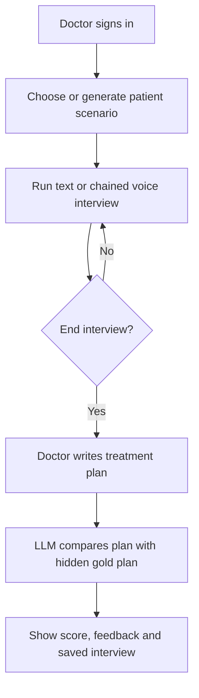

# POZZ — core business flow: simulated medical interview

```mermaid
flowchart TD
  A[Doctor signs in] --> B[Choose or generate patient scenario]
  B --> C[Run text or chained voice interview]
  C --> D{End interview?}
  D -- No --> C
  D -- Yes --> E[Doctor writes treatment plan]
  E --> F[LLM compares plan with hidden gold plan]
  F --> G[Show score, feedback and saved interview]
```

Voice uses the current chained STT → LLM → TTS path; Live mode is shown as unavailable until implemented.
