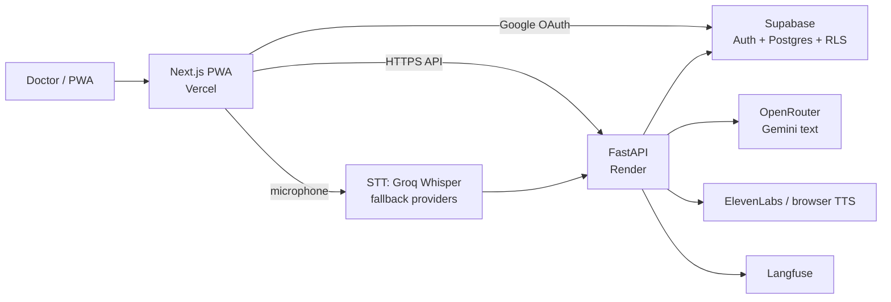

# POZZ — current architecture

```mermaid
flowchart LR
  D[Doctor / PWA] --> FE[Next.js PWA\nVercel]
  FE -->|Google OAuth| SB[Supabase\nAuth + Postgres + RLS]
  FE -->|HTTPS API| API[FastAPI\nRender]
  API --> SB
  API --> OR[OpenRouter\nGemini text]
  FE -->|microphone| STT[STT: Groq Whisper\nfallback providers]
  STT --> API
  API --> TTS[ElevenLabs / browser TTS]
  API --> LF[Langfuse]
```

Current scope: chained STT → LLM → TTS; Gemini Live browser mode remains planned, not implemented. Postgres holds jobs; no Redis in MVP.
