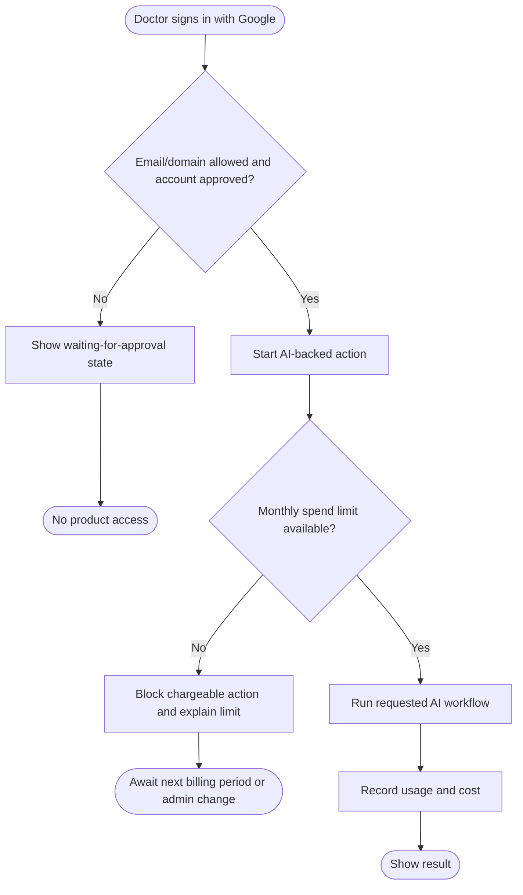

# POZZ — business flow: access approval and AI spend guard

```mermaid
flowchart TD
    start([Doctor signs in with Google]) --> allow{Email/domain allowed and account approved?}
    allow -- No --> pending[Show waiting-for-approval state]
    pending --> end1([No product access])
    allow -- Yes --> action[Start AI-backed action]
    action --> cap{Monthly spend limit available?}
    cap -- No --> block[Block chargeable action and explain limit]
    block --> end2([Await next billing period or admin change])
    cap -- Yes --> run[Run requested AI workflow]
    run --> usage[Record usage and cost]
    usage --> end3([Show result])
```
