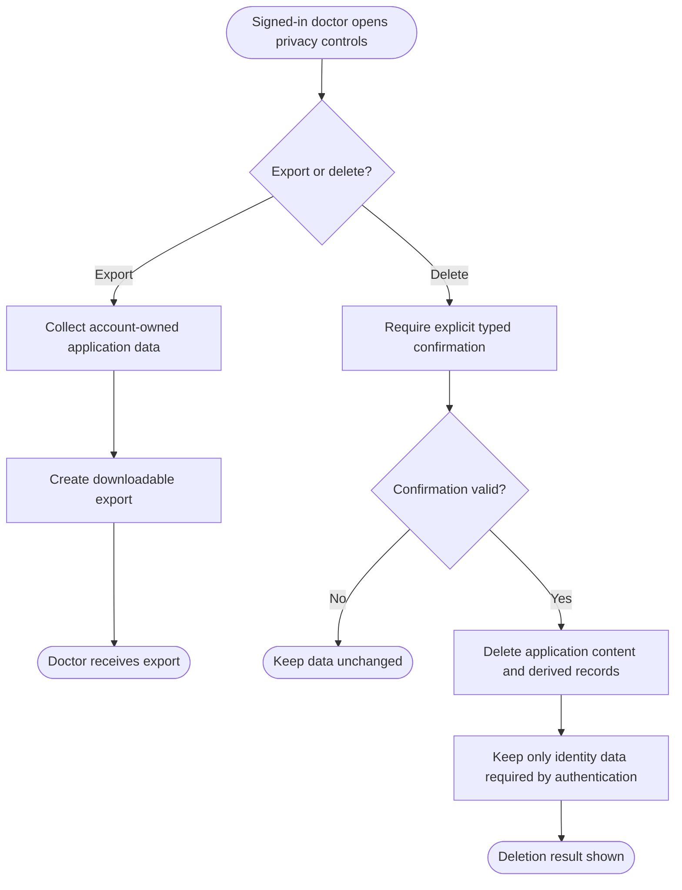

# POZZ — business flow: personal-data export and deletion

```mermaid
flowchart TD
    start([Signed-in doctor opens privacy controls]) --> choose{Export or delete?}
    choose -- Export --> collect[Collect account-owned application data]
    collect --> package[Create downloadable export]
    package --> exportEnd([Doctor receives export])
    choose -- Delete --> confirm[Require explicit typed confirmation]
    confirm --> approved{Confirmation valid?}
    approved -- No --> cancel([Keep data unchanged])
    approved -- Yes --> erase[Delete application content and derived records]
    erase --> retain[Keep only identity data required by authentication]
    retain --> deleteEnd([Deletion result shown])
```
